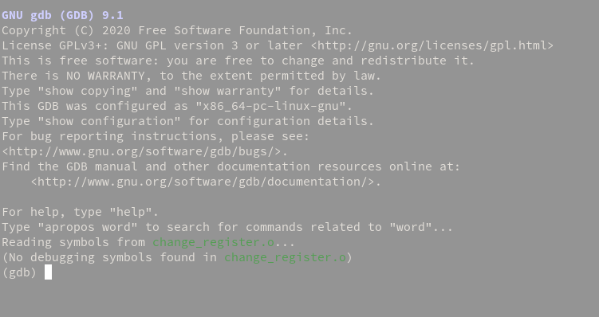
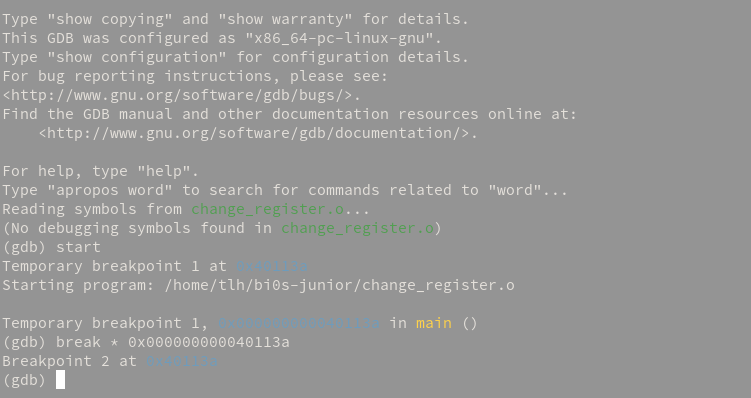
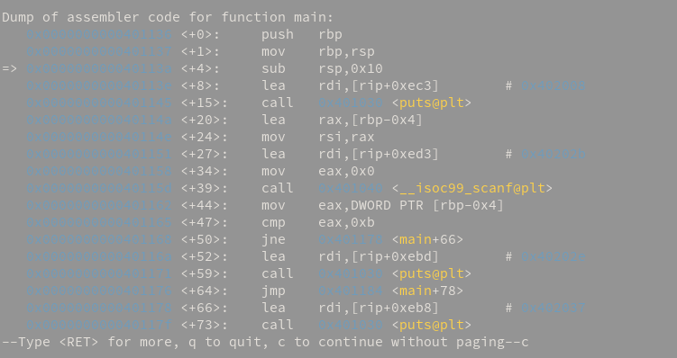
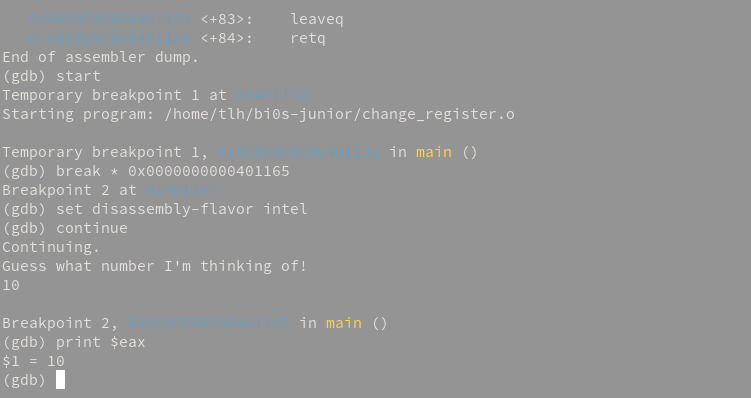
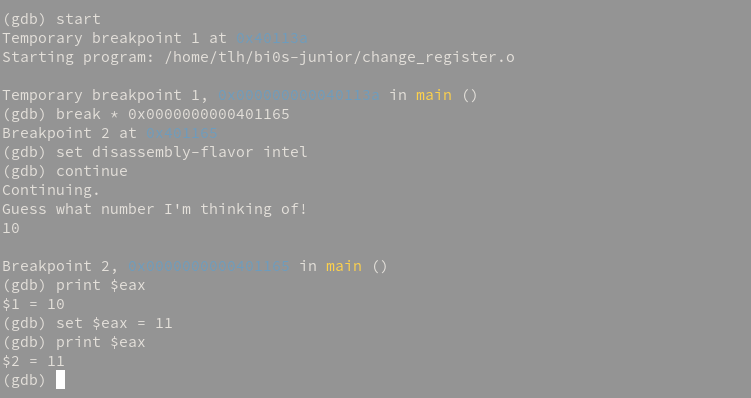

# Tutorial

This tutorial is here to help you start with reversing with a primary focus on GDB.

## What is GDB?

GDB is the _GNU Debugger_, which is by default installed in most (Debian-based, at least) distros. If it isn't installed in yours, run `sudo apt install build-essential`. 

### Basic stuff

You can start debugging an executable with `gdb <file name>`.

We'll be mostly focussing on C executables, even though GDB can debug others as well, since C is the easiest to debug.

This is the screen that you'll be greeted with in gdb. You'll see that I have already loaded the first chall in this very basic series.

You can run the program using `run` or using `start`, you can make the program break when `main` is loaded.

### What's this about breaks?

If you've ever used a debugger, you know what breakpoints are. They help you understand the code by essentially pausing the code flow where you want them to. You can add breakpoints by using the `break` keyword, like this:

The way to put a breakpoint is `break * <memory_address>` or `break <name>`, like `break main`.

### Disassembly

The way to do reversing is by understanding what that particular executable is executing. For that, we need the assembly code that is being run. To get the assembly code, use `disas` to get the disassembly of the function that you need. To get the list of functions, just use `info functions`.

You might want to set the disassembly syntax to Intel, by typing `set disassembly-flavor intel` before you disassemble.

Let's start analyzing the code, starting from the 4th line. 

The fourth line uses the `lea` opcode (short for _operation code_) to **L**oad the **E**ffective **A**ddress of `rip+0xec3` into `rdi`. `rdi` is the argument for puts (which is a C function similar to printf).

The fifth line prints it. Nothing interesting so far.

The real interesting stuff happens at line 12. Before this, the program has asked for input and then accepted it. It's in line 12 where a `cmp` instruction is made with 0xb (11 in decimal). It looks like the next instruction tells it to jump to the 17th line if `eax` is not equal to 0xb.

Let's change the register value.

### Setting register values

You can print the value of a register by using the `print` command.

As you can see, my input was 10, and `eax` has the value 10.

You can set it to 11 with `set`, like this:

As you can see, `eax` has been changed to 11.

And if you continue, you'll see that:

You've cracked the code!

### Useful shortcuts

run `set $eflags ^= 1 << 6` if you want to set/reset the Zero Flag. Here's how it works: 

The `eflags` register is the x86 equivalent of the FLAGS register from 16-bit assembly, and it contains the zero flag in the 6th bit. By using `set $eflags ^= 1 << 6`, you're XORing the current value of `eflags` with 100000, which means the 6th bit is XORed with 1, to set/reset it.

### More resources

- [GDB Cheat Sheet](https://darkdust.net/files/GDB%20Cheat%20Sheet.pdf): This has a lot more commands and nice, short descriptions of what they do.

